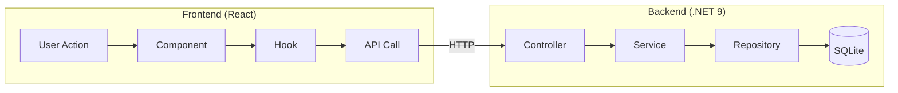
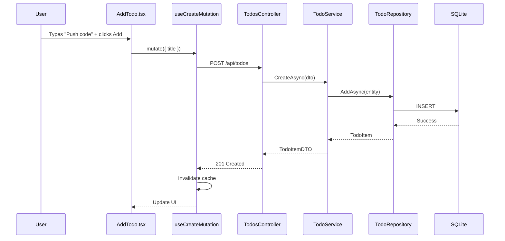
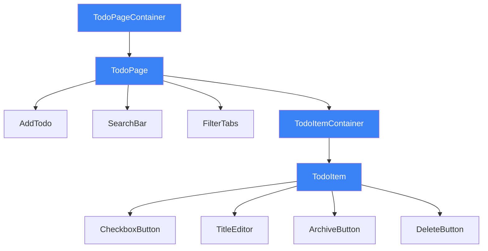

# Todo App

A fullstack task management application built with .NET 9 and React, demonstrating Clean Architecture principles and modern development practices.

## Table of Contents

- [Quick Start](#quick-start)
- [Application Overview](#application-overview)
- [API Reference](#api-reference)
- [Testing](#testing)
- [Assumptions](#assumptions)
- [Known Limitations](#known-limitations)
- [Architecture](#architecture)
- [Design Decisions](#design-decisions)
- [Scalability](#scalability-considerations)

---

## Quick Start

### Prerequisites

- [.NET 9.0 SDK](https://dotnet.microsoft.com/download/dotnet/9.0)
- [Node.js 18+](https://nodejs.org/)
- EF Core tools: `dotnet tool install --global dotnet-ef`
- npm or nvm if you have multiple node versions

### Backend Setup

```bash
cd Server

# Install EF tools if not already installed
dotnet tool install --global dotnet-ef

# Restore dependencies and create database
dotnet restore
dotnet ef database update --project TodoApi.Infrastructure --startup-project TodoApi.Api

# Run the API
dotnet run --project TodoApi.Api

# API: http://localhost:5209
# Swagger: http://localhost:5209/swagger
```

### Frontend Setup (in new terminal)

App runs at http://localhost:5173

```bash
cd Client
npm install
npm run dev
```

---

## Application Overview

A task management app where users can create, edit, complete, archive, and delete todos. Built as a demonstration of fullstack development with emphasis on clean architecture, type safety, and user experience.

**Backend:** .NET 9, EF Core, SQLite, xUnit
**Frontend:** React 19, TypeScript, React Query, Zustand, Tailwind CSS, Vite

### Core Features

- CRUD operations with inline editing
- Server-side pagination and status filtering
- Optimistic updates with automatic rollback
- Keyboard shortcuts for power users
- Accessible (ARIA labels, screen reader announcements)

---

## API Reference

| Method | Endpoint          | Description                                              |
| ------ | ----------------- | -------------------------------------------------------- |
| GET    | /api/todos        | Get todos (supports `?page=1&pageSize=10&status=active`) |
| GET    | /api/todos/{id}   | Get single todo                                          |
| GET    | /api/todos/counts | Get counts by status for filter tabs                     |
| POST   | /api/todos        | Create todo                                              |
| PATCH  | /api/todos/{id}   | Update todo                                              |
| DELETE | /api/todos/{id}   | Delete todo                                              |

**Status filter values:** `all`, `active`, `completed`, `archived`

---

## Testing

### Backend Integration Tests

```bash
cd Server
dotnet test
```

Tests cover full HTTP pipeline: Controller → Service → Repository → SQLite (file-based).

Coverage:

- GET /api/todos: Empty state, populated state
- POST /api/todos: Valid creation, validation errors
- GET /api/todos/{id}: Existing and non-existent todos
- PATCH /api/todos/{id}: Update title, mark complete, archive
- DELETE /api/todos/{id}: Successful deletion, non-existent todos

### Frontend Tests

```bash
cd Client
npm test
```

Coverage:

- Loading, error, and empty states
- Search filtering (case-insensitive, special characters, whitespace handling)

---

## Assumptions

1. **Single user:** No authentication required for demo
2. **Small dataset:** Hundreds of todos, not millions
3. **Modern browser:** ES6+, no IE11 support
4. **Local SQLite:** Appropriate for demo, not production
5. **No offline support:** Requires network connectivity

---

## Known Limitations

1. **Search filters current page only** — Server-side search endpoint needed for cross-page search
2. **SQLite DateTimeOffset** — Can't sort by DateTimeOffset; using DateTime instead
3. **50ms search debounce** — Tradeoff between responsiveness and render batching
4. **No bulk operations** — Cannot select multiple todos for batch actions
5. **No due dates** — Tasks don't have deadlines or reminders

---

## Architecture

### High-Level Flow



### Example Flow: Creating a Todo

1. **User** types "Push code cleanup changes to azure" and clicks Add
2. **AddTodo.tsx** calls `createMutation.mutate({ title })`
3. **useCreateMutation** sends POST to `/api/todos`
4. **TodosController** receives request, calls `ITodoService.CreateAsync()`
5. **TodoService** validates, creates a `TodoItem` domain entity, calls `ITodoRepository.AddAsync()`
6. **TodoRepository** persists to SQLite via Entity Framework
7. **Response** returns new `TodoItemDTO`
8. **React Query** invalidates cache, refetches, and updates UI



---

### Backend Architecture (Clean Architecture)

Dependency flow

```
REQUEST FLOW                    DEPENDENCY DIRECTION
─────────────                   ────────────────────

TodoApi.Api                     Api
     │                           │
     ▼                           ▼
TodoApi.Application             Application ◄─── Infrastructure
     │                           │                (implements)
     ▼                           ▼
TodoApi.Infrastructure          Domain
     │
     ▼
TodoApi.Domain
```

**Goal:** Dependencies flow inward and domain has zero dependencies. Infrastructure implements interfaces defined in Application.

**Why this structure?**

- Easy to test: Mock `ITodoRepository` to test `TodoService` in isolation
- Flexible: Swap SQLite for PostgreSQL by changing only Infrastructure
- Maintainable: Business logic lives in one place (Application/Domain)

### Frontend Architecture

#### File structure

```
src/
├── api/          # Fetch wrapper, type-safe API calls
├── components/   # Reusable UI (Button, Loading, Error, Empty states)
├── features/     # Todo components
├── hooks/        # React Query, mutations, keyboard shortcuts
├── stores/       # Zustand (filters, search, notifications)
└── utils/        # Helpers (dates, accessibility)
```

#### Component Relationships

- **TodoPageContainer** — Data fetching, loading/error states
- **TodoPage** — Layout, coordinates child components
- **TodoItem** — Single todo with inline actions



**State:** React Query for server data, Zustand for UI state.

---

## Design Decisions

### Why Offset Pagination Over Cursor-Based?

Backend supports pagination via `?page=1&pageSize=10`. Chose offset pagination because:

- **Simpler implementation:** Standard LIMIT/OFFSET SQL
- **Appropriate for dataset size:** Todo lists are typically <1000 items
- **Supports random access:** Users can jump to page 5 directly

**When I'd use cursor pagination:** Social media feeds, infinite scroll, handling millions of records, or frequently changing data where offset would cause duplicates/skips.

### Why Server-Side Status Filtering + Client-Side Search?

Status filtering (All/Active/Completed/Archived) happens server-side:

```
GET /api/todos?page=1&pageSize=10&status=active
```

**Benefits:**

- Pagination counts are accurate for the filtered set
- Scales to large datasets without fetching everything

Search remains client-side because:

- Instant feedback without network latency
- Acceptable tradeoff for personal todo lists

**Limitation:** Cross-page search would need a server-side endpoint.

### Why Optimistic Updates?

Allows immediate UI updates when toggling between complete/incomplete and archive/unarchive, and delete, without waiting for the server confirmation. 

**Benefits:**

- **Responsive feel:** No loading spinners for simple actions
- **Automatic rollback:** React Query reverts if server fails

---

## Scalability Considerations

### Current State (Single User, <1000 Todos)

- SQLite file database
- Server-side pagination and status filtering
- Client-side search
- No authentication

### Scaling to 10K+ Todos

- Utilize server-side pagination using different strategies
- Add server-side search endpoint for _all_ todos
- Add database indexes on `CreatedAt`, `IsCompleted`, `IsArchived`

### Scaling to Multiple Users

- Add User entity and authentication (JWT)
  - Possibly multiple users in one profile to allow switching between todolists in different domains (personal projects vs. work)
- Add `UserId` foreign key to `TodoItem`
- Filter queries by authenticated user
- Add authorization middleware

### Scaling to High Traffic

- Replace SQLite with PostgreSQL
- Add Redis caching for read-heavy endpoints
- Consider read replicas for queries
- Add rate limiting middleware
- Deploy behind load balancer
- Production security: HTTPS enforcement, antiforgery tokens, password hashing (i.e. bcrypt), tightened CORS policy
